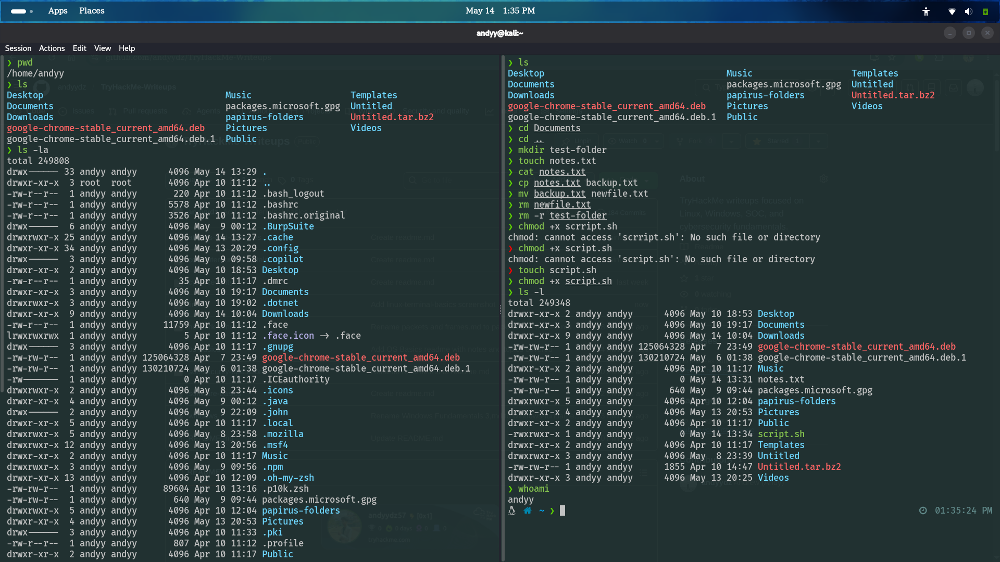
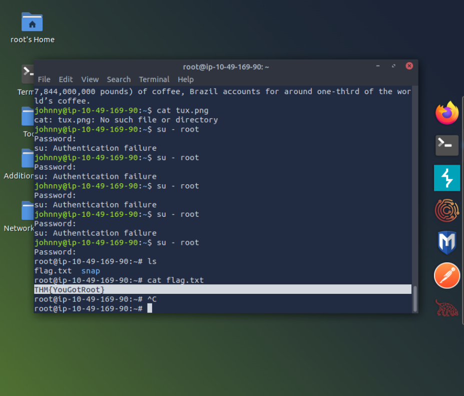

# Linux Fundamentals – TryHackMe

## Overview

This write-up summarizes my hands-on learning from the *Linux Fundamentals* room on TryHackMe. It covers core Linux concepts, basic commands, and their relevance in cybersecurity.

---

## Key Concepts

### Linux Operating System

- Command-line based operating system  
- Widely used in servers and cybersecurity environments  

---

### File System Structure

- `/` → Root directory  
- `/home` → User directories  
- `/etc` → Configuration files  
- `/var` → Logs and variable data  

---

### File and Directory Commands

- `ls` → List files  
- `cd` → Change directory  
- `pwd` → Show current directory  
- `mkdir` → Create directory  
- `rm` → Remove files/directories

  

---

### File Viewing and Editing

- `cat` → View file content  
- `less` → View large files  
- `nano` → Edit files  

---

### Permissions

- `chmod` → Change permissions  
- `chown` → Change ownership  

Permissions:
- Read (r)  
- Write (w)  
- Execute (x)  

---

### User Management

- `whoami` → Current user  
- `sudo` → Execute commands as superuser

  

---

## Commands Practiced

```bash
pwd        # Show current directory
ls         # List files
cd         # Change directory
whoami     # Show current user
cat file   # Read file content
