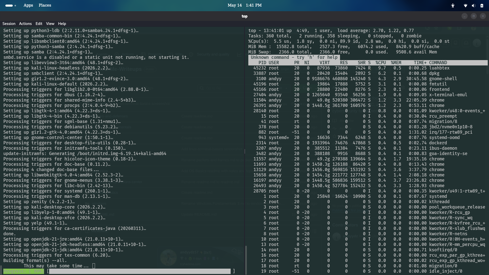

# Linux Fundamentals Part 2 - TryHackMe Write-up

## Overview
This room expanded on foundational Linux concepts and provided deeper hands-on experience with Linux systems through a virtual machine environment. The module focused on file system interaction, permissions, common Linux directories, command flags and switches, and secure remote access using SSH.

The room also included practical exercises involving SSH access to a remote Linux machine, where I interacted with system files, explored directories, and retrieved challenge flags through command-line investigation.

Linux knowledge is highly important in cybersecurity because many enterprise servers, cloud systems, and security tools operate on Linux-based environments.

---

# Topics Covered
- Introduction to Linux Fundamentals Part 2
- Accessing Linux Machines Using SSH
- Introduction to Flags and Switches
- File System Interaction Continued
- Permissions 101
- Common Linux Directories
- Virtual Machine Practical Exercises
- Linux Investigation Fundamentals
- Conclusion and Summaries

---

# What I Learned
Through this room, I gained practical experience interacting with Linux systems remotely and developed a deeper understanding of Linux file systems, permissions, and command-line operations.

Some of the major concepts learned include:
- Accessing remote Linux systems using SSH
- Using command flags and switches effectively
- Navigating Linux directories and file systems
- Understanding Linux file permissions
- Exploring common system directories
- Investigating files and retrieving information from Linux environments

The room also improved my confidence in interacting with Linux systems commonly used in cybersecurity and enterprise environments.

---

# Hands-on Experience

During the practical exercises, I connected to a Linux machine through SSH and interacted with system files and directories inside a virtual machine environment.

## Practical Activities
- Connecting to remote systems using SSH
- Navigating directories through the Linux CLI
- Reading and investigating files
- Using command flags and switches
- Understanding Linux permissions
- Retrieving challenge flags from system files

This hands-on experience improved my understanding of Linux system interaction and remote administration.

---

# Commands & Concepts Explored

## SSH Access
SSH (Secure Shell) allows secure remote access to Linux systems.

### Example

```bash
ssh user@ip_address
```

SSH is widely used for:
- Remote administration
- Secure system management
- Server access
- Security investigations

---

## Flags & Switches
Linux commands use flags and switches to modify command behavior.

### Example

```bash
ls -la
```

This command displays:
- Hidden files
- Detailed file permissions
- Ownership information

Flags improve command flexibility and system interaction.

---

## File System Interaction
The room focused heavily on navigating and interacting with Linux file systems.

### Commands Practiced

```bash
pwd
ls
cd
cat
find
cp
mv
```

These commands help users:
- Navigate systems
- Read files
- Locate important data
- Manage directories


---

## Permissions 101
Linux permissions control who can access or modify files and directories.

### Example

```bash
chmod
chown
```

Permissions are important for:
- Access control
- System security
- User management
- Protecting sensitive information

---

## Common Linux Directories

Some commonly explored directories included:
```text
/home
/etc
/var
/tmp
/root
```
