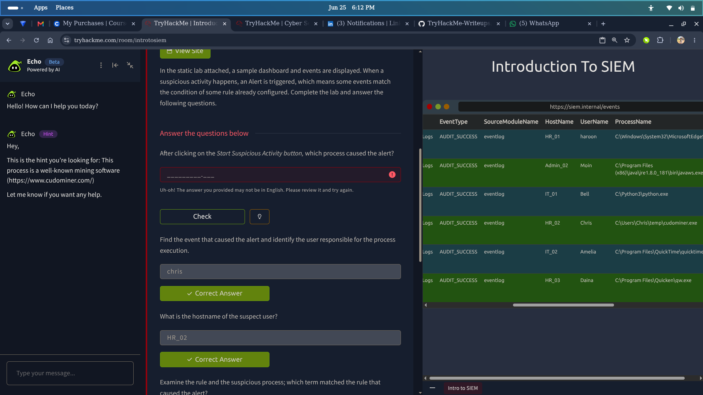

> **Key Finding:** Logs are everywhere but answers are nowhere — SIEM solves this by centralising, correlating, and alerting on data from every source in the environment, turning noise into actionable intelligence.

## Overview
This room introduces SIEM — what it is, why it exists, and how it works. Covers host-centric and network-centric log sources, the challenges of working with isolated logs, and how SIEM features like normalisation, correlation, and real-time alerting help SOC analysts detect and investigate threats. Includes a hands-on lab investigating a suspicious activity alert inside a SIEM dashboard.

---

## What I Actually Found

| Topic | Finding |
|---|---|
| SIEM full form | Security Information and Event Management |
| Problem SIEM solves | Logs generated everywhere with no centralisation, limited context, format issues, and no correlation |
| Host-centric log sources | User file access, authentication attempts, process execution, registry changes, PowerShell execution |
| Network-centric log sources | Network connections, FTP file transfers, web traffic, VPN access, network file sharing |
| SIEM core features | Centralised log collection, log normalisation, log correlation, real-time alerting, dashboards, reporting |
| Use Case 1 | Detection rule: if Windows Event Log ID matches — triggers alert for event log cleared |
| Use Case 2 | Post-exploitation privilege escalation detection using `whoami` execution after compromise |
| Lab alert result | True positive — suspicious process execution identified and confirmed |

---

## Hands-On Activities

### Log Sources and the Problem of Isolation
Explored why isolated logs are insufficient for modern security operations:
- **Numerous log sources** with no centralisation
- **Limited context** when logs are viewed in isolation
- **Format inconsistencies** across different systems
- **No correlation** between events happening across multiple devices simultaneously

### Host-Centric vs Network-Centric Log Sources

| Log Type | Examples |
|---|---|
| Host-Centric | User accessing a file, authentication attempts, process execution, registry key changes, PowerShell execution |
| Network-Centric | Network connections, FTP file transfers, web traffic, VPN access, network file sharing activity |

### Why SIEM
SIEM addresses the flood of log data by:
- **Collecting** data from all sources into one centralised location
- **Aggregating** and normalising logs into a consistent format
- **Detecting** threats through correlation rules
- **Identifying** breaches and anomalies in real time
- **Investigating** alerts through a unified dashboard

### SIEM Features Deep Dive
- **Centralised log collection** — single pane of glass for all log sources
- **Log normalisation** — converts different formats into a standard structure
- **Log correlation** — links related events across sources to surface threats
- **Real-time alerting** — notifies analysts the moment a rule fires
- **Dashboards and reporting** — visualises environment health and threat activity

### Detection Rules and Alert Analysis

#### Use Case 1 — Event Log Cleared
Rule logic: if logs source is Windows Event Log and Event ID matches log-clearing event → trigger alert. A cleared event log is a common attacker technique to cover tracks.

#### Use Case 2 — Post-Exploitation Privilege Check
Rule logic: detects execution of `whoami` following a potential exploitation event — a common attacker behaviour to confirm privilege level after gaining access.

### Lab — Suspicious Activity Investigation

*SIEM dashboard showing incoming alerts and event overview*

Worked through a real SIEM dashboard to investigate a triggered alert:
- Identified **what caused the alert** and **which website** was involved
- Located the **specific event** that triggered the detection rule

*Drilling into the triggered alert to identify the responsible user and process*

- Identified the **user responsible** for the suspicious process execution — confirmed as **Crease**
- Determined the **hostname** of the suspect user's machine

*Confirming the alert as a true positive and retrieving the flag*

- Confirmed the alert was a **true positive**
- Retrieved the **flag**

---

## SOC Analyst Relevance

| Skill Practiced | SOC Application |
|---|---|
| SIEM navigation | Primary day-to-day tool for SOC L1 analysts monitoring alerts |
| Log source identification | Knowing where logs come from helps analysts find evidence faster |
| Alert triage | Determining true vs false positive is the core SOC L1 responsibility |
| Detection rule understanding | Knowing how rules fire helps analysts interpret and tune alerts |
| Threat correlation | Linking events across host and network logs to build the full attack picture |
| Incident scoping | Identifying affected user, hostname, and process during investigation |

---

## Key Takeaways

- SIEM stands for Security Information and Event Management — it is the central nervous system of a SOC
- Logs in isolation provide limited value — correlation across sources is what reveals the full attack story
- Host-centric logs track what users and processes do; network-centric logs track how data moves
- SIEM normalises log formats so events from Windows, Linux, and network devices can be compared
- Detection rules define the conditions that trigger alerts — understanding them is essential for alert triage
- Clearing event logs is a known attacker technique — SIEM can detect and alert on this behaviour
- A compromised device should be isolated quickly to prevent lateral movement across the network
- SIEM gives SOC analysts the visibility needed to detect, investigate, and respond to threats at scale

---

*Part of my [TryHackMe Writeups](https://github.com/andyydz/TryHackMe-Writeups) portfolio — documenting my SOC analyst journey.*
